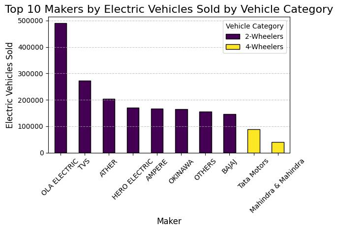
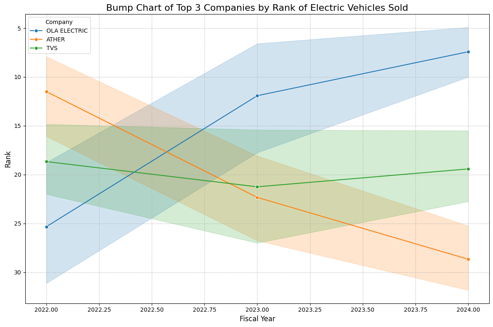
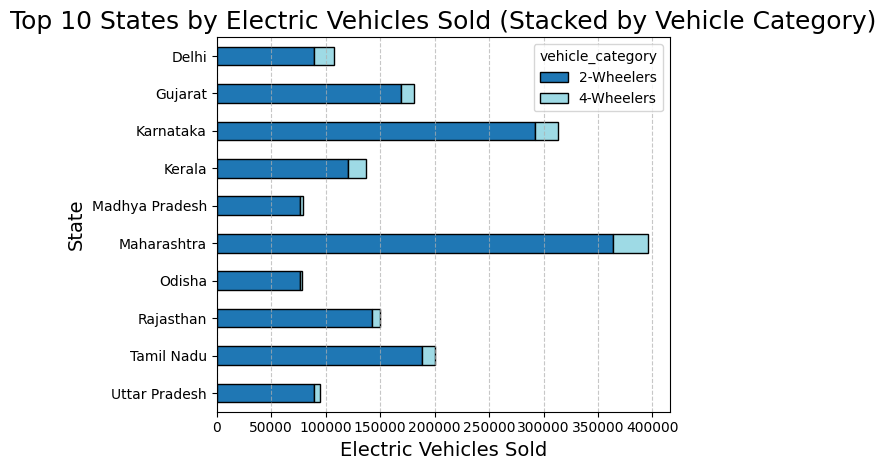
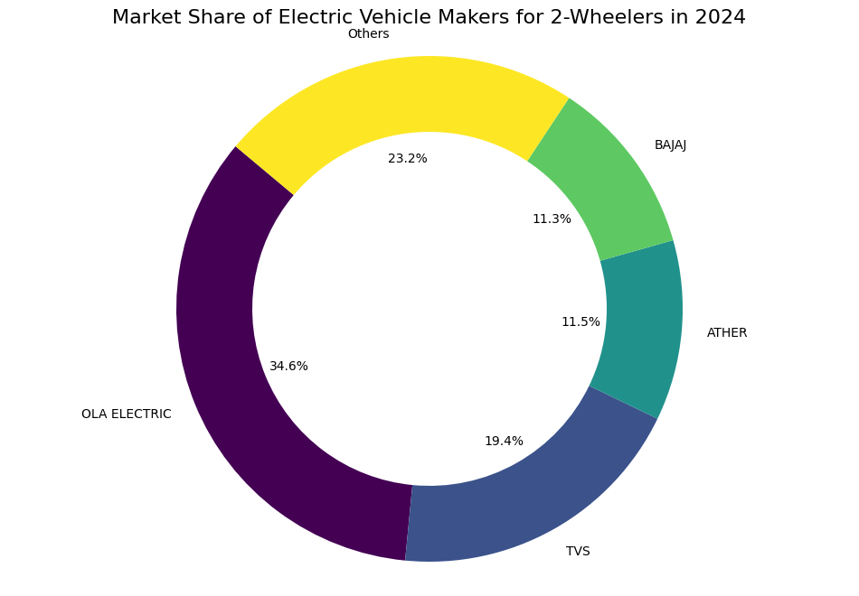

# Launching AtliQ Motors in the Indian Electric 2-Wheeler Market

## Executive Summary
This report outlines a strategic plan for AtliQ Motors to enter and compete in the Indian electric 2-wheeler market, dominated by players like Ola Electric, Ather Energy, and TVS Motor Company. The analysis includes a review of competitors' strengths, market opportunities, and a detailed go-to-market strategy for AtliQ Motors.

## Market Analysis

### 1. Ola Electric
- **Strengths**: Aggressive marketing, rapid production, and competitive pricing.
- **Weaknesses**: Primarily urban-focused, relatively new in the market.

### 2. Ather Energy
- **Strengths**: High-quality, premium scooters with advanced technology, strong urban presence.
- **Weaknesses**: Higher price point, limited to major cities.

### 3. TVS Motor Company
- **Strengths**: Extensive distribution network, strong brand trust, cost-effective models.
- **Weaknesses**: Slower transition from ICE to electric, less focus on high-end technology.

## Strategic Plan for AtliQ Motors

### 1. Product Strategy

**Positioning**: Mid-range premium electric scooters that balance cost, quality, and advanced features.

- **Features**: Smart connectivity, efficient battery technology, stylish design, and robust performance.
- **Product Line**: Launch with two models – an entry-level scooter with essential features and a high-end model with premium features.
- **Customization**: Offer customization options to cater to diverse consumer preferences.

### 2. Production and Supply Chain

**Leverage Advanced Manufacturing**: Build a state-of-the-art manufacturing facility inspired by Ola's Futurefactory to ensure high production capacity and automation.

- **Strategic Location**: Establish the plant in a central location with access to major markets and suppliers.
- **Sustainable Practices**: Implement eco-friendly manufacturing processes to appeal to environmentally conscious consumers.

### 3. Marketing and Branding

**Comprehensive Marketing Campaign**:

- **Digital Presence**: Utilize social media, influencers, and online campaigns to build brand awareness.
- **Launch Events**: Host high-profile launch events in major cities to create buzz and media coverage.
- **Customer Engagement**: Create interactive and engaging marketing content to connect with tech-savvy consumers.

**Brand Positioning**:

- **Unique Selling Proposition (USP)**: Emphasize the balance of cost, quality, and advanced features.
- **Partnerships**: Collaborate with local celebrities and influencers to enhance brand credibility.

### 4. Distribution and Sales

**Multi-Channel Approach**:

- **Direct Sales**: Develop an online sales platform for direct purchases and home delivery.
- **Dealer Network**: Establish a network of trusted dealers and service centers, leveraging TVS's distribution model.
- **Urban and Rural Presence**: Ensure a strong presence in both urban and rural areas to tap into different market segments.

**Customer Experience**:

- **Test Rides and Demo Centers**: Set up demo centers and offer test rides to potential customers.
- **Service and Maintenance**: Provide exceptional after-sales service with doorstep maintenance and support.

### 5. Charging Infrastructure

**Comprehensive Charging Network**:

- **Partnerships**: Partner with existing charging network providers and explore opportunities for exclusive charging stations.
- **In-House Infrastructure**: Develop a proprietary charging network similar to Ather Grid in key locations.

### 6. Competitive Pricing

**Value for Money**: Offer competitive pricing with flexible financing options and subscription plans for battery replacement and servicing.

### 7. Regulatory Compliance and Incentives

**Government Policies**: Stay updated with government incentives and subsidies for electric vehicles to reduce costs and encourage adoption.

**Regulatory Compliance**: Ensure all products meet safety and environmental regulations.

### 8. Continuous Improvement and Innovation

**R&D Investment**: Invest in research and development to continuously improve product offerings and stay ahead of market trends.

**Customer Feedback**: Implement a robust feedback system to gather insights and make necessary improvements.

## Market Data and Analysis

### Top 10 EV Brands for 2-Wheelers

### Growth of Top 3 Companies (Fiscal Year 2022-2024)

### Top 10 States with Most EV Vehicles Sold

### Top 10 EV Sales in Fiscal Year 2024

### Market Share in India of Major Companies

## Conclusion

By leveraging advanced manufacturing, comprehensive marketing, strategic distribution, and a balanced product offering, AtliQ Motors can effectively compete with Ola Electric, Ather Energy, and TVS Motor Company in the Indian electric 2-wheeler market. The focus on quality, customer experience, and innovation will position AtliQ Motors as a strong contender in this rapidly growing sector.
